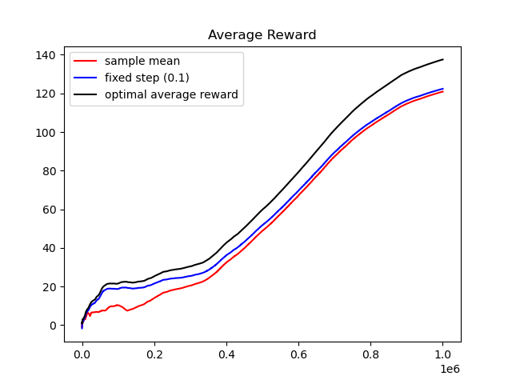
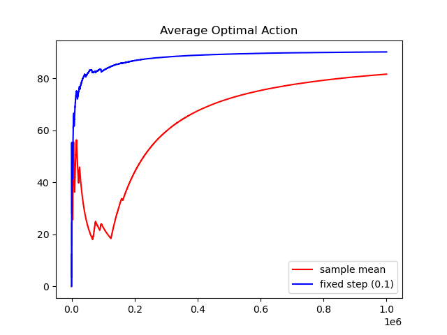

# Overview

This is an implementation of exercise 2.5 from [Sutton and Barto]().

The exercise is to compare two espilon-greedy action-value estimate RL agents. One agent uses the reward sample mean as its action value estimator whereas the other uses a weighted average with a fixed step size. The distributions from which action rewards are drawn is varied at each timestep.

Below are plots of each agent's average reward and decision quality over time.

